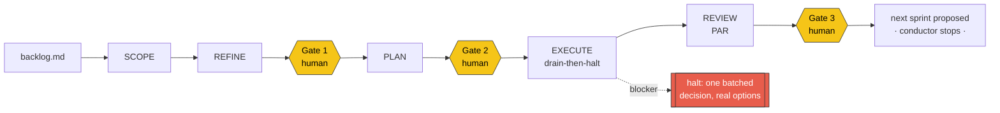

# supskill

**A sprint conductor for Claude Code.** It drives one sprint from a markdown backlog to a merged branch — drawing a fresh context boundary at every stage, holding three human gates, and keeping every byte of authoritative state on disk so it survives its own context death.

[](https://github.com/bessavagner/supskill/actions/workflows/ci.yml)
[](https://www.python.org/downloads/)
[](#testing)
[](pyproject.toml)
[](https://github.com/astral-sh/ruff)
[](LICENSE)

---

## The finding this is built on

> **A delegated agent cannot ask you anything. In a subagent or a headless session, `AskUserQuestion` is not available, so at the layer where the work actually happens there is no channel to escalate a decision to you.**

When I first built supskill, the runtime failed this claim silently: [claude-code issue #50728](https://github.com/anthropics/claude-code/issues/50728) (Python Agent SDK, closed not planned) reported a headless `AskUserQuestion` call receiving an empty answer in about 37 milliseconds, the agent proceeding as if you had spoken. That 37ms figure is the issue's report, not my measurement. Re-checking on Claude Code 2.1.210, that exact behavior did not reproduce on the paths I tested: `AskUserQuestion` is absent from a headless session's tool manifest and unavailable inside a subagent, and calling it now returns a loud error rather than a silent empty answer. The load-bearing problem survives the change. Every autonomous-coding framework that promises to "escalate to the human when it gets stuck" is, at the layer where the work actually happens, promising something the runtime still cannot deliver: a delegated agent has no channel to escalate a decision, so nothing forces it to stop and ask rather than guess with the tools it has. (I re-tested the CLI and subagent paths, not the Python Agent SDK #50728 was filed against.)

You cannot fix that by making the agent smarter. You fix it by **removing the situation in which guessing is the only move left.**

That is what supskill is. Everything below is downstream of that one sentence.

---

## The problem

Running a sprint through the Claude Code skill chain — `sprint-plan` → `writing-plans` → `subagent-driven-development` — works. Ten sprints of a prior project were run exactly this way.

But the operator clears context twice per sprint, retypes the invocation three times, and hand-copies a scratch-directory namespacing ritual that nothing enforces. The repetition is the visible cost. **The real cost is that the entire discipline lives in the operator's memory** — and memory is not a mechanism.

Worse, the chain doesn't actually compose. `sprint-plan` emits stories and points. `writing-plans` expects a *spec*. The undocumented pass that bridges them — re-reading the live source at pull time and growing the scope to fit what's actually there — is the step that made every one of those ten sprints work, and it is written down nowhere.

## What supskill does

It makes the discipline structural.



Each stage runs in a **fresh context**. Each gate is a **real human decision**, recorded verbatim to an append-only audit trail. And all authoritative state lives in `.supskill/state.json`, so the conductor is *disposable*: `/clear` mid-sprint, re-invoke, and it reconstructs exactly where it was from disk alone. It is never trusted to remember anything.

**Drain-then-halt** is the execution shape. The conductor runs every task it *can* run, parks everything a blocker poisons, and then stops **once** with the whole batch — a single high-information decision with materially different options and a recommendation you're free to reject. Not a stall in the middle. Not a silent invention.

A sprint that completes 4 of 6 tasks and halts with two real blockers is a **successful** run. That is the target shape, not an error state.

## The invariants

These are locked. No feature is allowed to weaken one.

| # | Invariant | Why |
|---|-----------|-----|
| 1 | **Compose, never reinvent.** | supskill orchestrates skills you already trust. It contributes zero opinions about how code gets written. |
| 2 | **Escalation is out-of-band, always.** | A delegated agent can never ask you anything. Any design that assumes otherwise is already broken. |
| 3 | **The script is the only mutator of state.** | The model may not advance a stage the script refuses. Not "should not" — *may not*. |
| 4 | **Scratch paths are derived, never typed.** | A collision must be structurally impossible, not conventionally avoided. |
| 5 | **The conductor is disposable.** | Any in-memory-only state is a bug. |
| 6 | **One sprint per invocation.** | Plans go stale. No look-ahead planning. |
| 7 | **The conductor never supersedes a backlog on its own.** | A north-star reset is operator-authored. Full stop. |

### The ceiling, stated honestly

The script **cannot prove a human answered a gate.** It makes skipping one loud and auditable — never impossible. This is a real limit and it is written into the design record rather than papered over. A tool that claims to make its own circumvention impossible is lying to you about something else too.

## Architecture

Two pieces, deliberately.

**`supskill-state`** — a pure-Python CLI, zero runtime dependencies. It is the only thing on earth permitted to write `state.json`, and every transition validates its preconditions before it will move:

```
init · show · artifact · gate · block · task · tasks · advance · plan-guard · cost
```

`advance --to PLAN` refuses without an approved Gate 1. `advance --to EXECUTE` refuses without an approved Gate 2, and refuses an empty task list. `advance --to REVIEW` refuses while any task is non-terminal. `block` refuses a blocker carrying fewer than two options, or a recommendation that doesn't name one of them — because a blocker without real options is a shrug, not a decision. `task` is the only verb that can finish one (`DONE` / `DONE_WITH_CONCERNS` / `PARKED`). `cost` is pure telemetry — it records a subagent dispatch's token/tool/duration usage and never touches `state.json` — so the open question of whether a given stage earns its keep in tokens gets answered from real numbers instead of guesswork.

If the CLI refuses, the conductor reports the refusal verbatim and stops. It never works around one.

**`skills/supskill/SKILL.md`** — the conductor. Pure UX, zero enforcement. It reads state, dispatches each stage as a fresh-context subagent, raises the gates in the one place `AskUserQuestion` actually works — the interactive session — and writes every result back through the CLI. It is rebuilt from `state.json` on every single invocation.

The split is the point: **enforcement is deterministic and offline-testable; orchestration is a model's job.** Neither is asked to do the other's work.

## Testing

The state spine is the only part of an agentic system that can be proven correct *offline, fast, with real unit tests, before a single token is spent.* So it is, exhaustively.

```console
$ uv run pytest -q
........................................................................ [ 28%]
........................................................................ [ 57%]
........................................................................ [ 86%]
...................................                                      [100%]
314 passed in 0.58s
```

No LLM calls. No network. No subagents. No flake. The suite proves the gates cannot be skipped, and it runs faster than you can read this sentence.

**And it is not enough — which the project says out loud.** A green suite and a broken product are perfectly compatible here: the state verbs can be flawless while the loop that calls them invents a status. Whether the conductor *actually* halts instead of guessing is visible only in a real run with real tokens. So every sprint ends with an operator-run demo, and the sprint docs say plainly which points are offline-provable and which are not.

## Quickstart

Requires Python 3.11+ and [`uv`](https://docs.astral.sh/uv/).

```bash
git clone https://github.com/bessavagner/supskill.git
cd supskill
uv sync
uv run pytest -q          # 314 passing, offline, <1s
```

Install as a Claude Code plugin:

```bash
claude plugin marketplace add bessavagner/supskill
claude plugin install supskill@supskill
```

supskill **composes** skills that ship in other plugins rather than reimplementing them (invariant 1), so it declares them as dependencies and Claude Code resolves them for you at install time:

| Dependency | Provides | Used by |
|---|---|---|
| `superpowers` | `writing-plans`, `subagent-driven-development` | PLAN, EXECUTE |
| `pm-execution` | `sprint-plan` | SCOPE |

Both live in marketplaces other than supskill's own, and Claude Code blocks cross-marketplace dependencies by default — so supskill's `marketplace.json` names them explicitly in `allowCrossMarketplaceDependenciesOn`. A test asserts that **every skill the conductor dispatches has its plugin declared**: an undeclared skill wouldn't crash a stage, it would make the stage *improvise*, and silent guessing at a stage boundary is the one thing this product exists to prevent.

Then drive a sprint from any repo with a markdown backlog:

```
/supskill run s1 --backlog docs/plans/sprints/backlog-01/backlog.md
```

Then clear your context and run it again. It picks up exactly where it left off — because it never knew anything that wasn't on disk.

## Status

Alpha, and honest about it. Built in public, one sprint at a time — **by itself.**

| Epic | Scope | State |
|------|-------|-------|
| **E1** | The state spine | ✅ shipped |
| **E2** | Conductor skill + plugin skeleton | ✅ shipped |
| **E3** | SCOPE + REFINE + Gate 1 — *the heart* | ✅ shipped |
| **E4** | PLAN + Gate 2 | ✅ shipped |
| **E5** | EXECUTE — drain-then-halt | ✅ shipped |
| **E6** | REVIEW (PAR) + Gate 3 + replan | ✅ shipped |
| **E7** | Packaging & distribution | ✅ shipped |
| **E8** | Validation — *drive a real sprint or don't ship* | ⬜ backlog |

## What the evidence actually says

supskill plans its own sprints. Every sprint doc in [`docs/plans/sprints/`](docs/plans/sprints/) was produced by the conductor running against its own backlog — including the one for the EXECUTE stage, written before that stage existed.

That dogfooding produced the project's most interesting result. **Five sprints; five times the refinement pass grew the scope; five times the sharpest finding was structural — and not one of them was visible from the backlog's own one-line description of the story.** A sample:

- The PLAN stage could have **executed the entire sprint before its own approval gate**, because the planning skill's handoff names a required execution sub-skill per branch — and a headless agent would have taken it, while `state.json` still read `PLAN`.
- The state spine could start a task and block a task, but had **no verb that could finish one** — so no sprint could ever have reached REVIEW. Every task in a fully successful sprint would have stayed `PENDING` forever.
- A gate could have **silently self-approved** in headless mode: a delegated agent has no channel to escalate the decision a gate requires, so a `gate` verb that accepted an empty or defaulted response would have logged that missing answer as approval.

Each of these was a sprint-ending defect. Each was found by reading the live source at pull time, not by planning harder. That is the entire thesis of the refine-at-pull-time stage, and the project has now argued it five times against its own code.

## Design record

Nothing here was decided by vibes. The reasoning, the rejected alternatives, and the evidence are all committed:

- [**Design decisions**](docs/.ai/reports/2026-07-12-supskill-design-decisions.md) — D1–D9, including why building standalone beat forking the closest competitor *after reading its source rather than its README*.
- [**Backlog**](docs/plans/sprints/backlog-01/backlog.md) — epics, stories, and the findings that shape them.
- [**Sprint docs**](docs/plans/sprints/backlog-01/) — every refinement pass and every DoR delta, with citations to `file:line`.
- [**State schema**](docs/state-schema.md) — the on-disk contract.

## License

MIT — see [LICENSE](LICENSE).

---

<sub>Built by <a href="https://github.com/bessavagner">Vagner Bessa</a>. The product is the boundaries, the gates, and the escalation — not a methodology.</sub>
